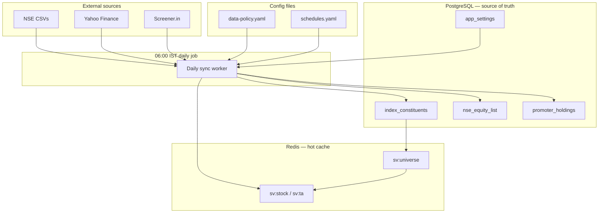

# Data Rules — Storage, Sync & Configuration

**Authoritative policy** for what Script Screener stores where, when external data is refreshed, and how runtime behavior is configured.

> Educational research tool only — not SEBI-registered investment advice.

**Related:** [Database](DATABASE.md) · [Redis & Cache](REDIS-CACHE.md) · [Architecture](ARCHITECTURE.md) · [Operations](OPERATIONS.md)

---

## Table of contents

1. [Core principles](#core-principles)
2. [Data classification](#data-classification)
3. [Daily 6 AM sync](#daily-6-am-sync)
4. [Configuration hierarchy](#configuration-hierarchy)
5. [Config files](#config-files)
6. [Settings UI](#settings-ui)
7. [Implementation status](#implementation-status)
8. [Developer checklist](#developer-checklist)

---

## Core principles

| # | Rule |
|---|------|
| **R1** | **Slow-changing / reference data lives in PostgreSQL.** Index membership, NSE symbol lists, promoter holdings, system presets, and user records are the source of truth — not Redis, not in-memory defaults. |
| **R2** | **Market and derived data is cached in Redis** with explicit TTLs. Redis is a performance layer; PostgreSQL + config define what “fresh” means. |
| **R3** | **External fetches run on a schedule, not on every page load.** Latest market/fundamental changes are pulled **once per day at 06:00 IST** (configurable). User actions may trigger on-demand refresh only when explicitly requested (e.g. “Refresh” button). |
| **R4** | **Behavior is driven by version-controlled config files** under `config/`. Code reads config at startup; do not hard-code thresholds, schedules, or preset maps in application logic. |
| **R5** | **Operators override config via Settings** (Admin UI → persisted in `app_settings`). Settings win over config files; config files win over code defaults. |
| **R6** | **Secrets stay in environment variables** (`.env`). Never store API keys, JWT secrets, or passwords in config files or the database. |



---

## Data classification

### Tier 1 — PostgreSQL (does not change intraday)

Store here. Update via admin upload, daily sync, or user CRUD — **not** on every API request.

| Data | Table / model | How it changes | Current v2 |
|------|---------------|----------------|------------|
| Index constituents | `index_constituents`, `universe_symbols` | CSV import, `sync:indices`, daily job | ✅ Manual CLI + Admin |
| NSE full equity list | `nse_equity_list` | `EQUITY_L.csv` upload, daily job | ✅ Admin upload |
| Promoter holdings | `promoter_holdings` | CSV upload, daily job | ✅ Admin upload |
| Universe definitions | `universes` | Seed + custom user universes | ✅ |
| System screener presets | `screener_presets` (`is_system=true`) | Config seed → DB migrate | 🔲 Planned |
| Strategy registry (system) | `screener_presets` or dedicated table | Config seed | 🔲 [TRADING-STRATEGIES.md](TRADING-STRATEGIES.md) |
| User watchlists / positions | `watchlist_*`, `swing_positions` | User actions | ✅ |
| Verify history | `verification_runs` | Per-run persist | ✅ |
| Job audit trail | `jobs` | Worker creates on enqueue | ✅ |
| App settings overrides | `app_settings` (planned) | Admin Settings UI | 🔲 Planned |

**Rule:** If removing Redis would still let you reconstruct “who is in Nifty 50” or “what symbols exist on NSE”, that data belongs in PostgreSQL.

### Tier 2 — Redis (changes daily or per session)

Cache only. Populated by daily sync, scans, or on-demand refresh with TTL from `config/data-policy.yaml`.

| Data | Redis key | Typical TTL | Refresh trigger |
|------|-----------|-------------|-----------------|
| Yahoo OHLC + stock blob | `sv:stock:{symbol}` | 7d (override in config) | Daily 6 AM batch; verify/scan on miss |
| Raw Yahoo response | `sv:yahoo:...` | 7d | Same as stock |
| Screener.in row | `sv:screener:row:{symbol}` | 24h | Daily batch; screener on miss |
| Computed TA | `sv:ta:{symbol}` | 24h | Rebuilt when OHLC refreshes |
| Universe symbol list | `sv:universe:{key}` | 24h | After index sync / daily job |
| Index sync metadata | `sv:index:{key}` | 30d | After `sync:indices` |
| Market regime | `sv:regime:nifty` | 15m (intraday) | Pre-market warm + auto-radar |
| Intraday Nifty chart | `sv:ta:intraday:...` | Session-bound | Market hours only |
| Swing auto snapshot | `sv:swing:auto` | 2h | Auto-radar worker |
| Job progress | `sv:job:progress:{id}` | 1h | Ephemeral |

**Rule:** Redis values must be **derivable** from PostgreSQL + external APIs. Never store the only copy of user or reference data in Redis.

### Tier 3 — Ephemeral / request-scoped

| Data | Where | Notes |
|------|-------|-------|
| JWT access tokens | Client memory | Short-lived |
| WebSocket job stream | In-flight only | Not persisted |
| HTTP response bodies | Request | No cross-request state |

---

## Daily 6 AM sync

### Purpose

One coordinated job per calendar day (default **06:00 Asia/Kolkata**) refreshes everything that **can** change overnight — without hammering Yahoo/Screener on every user click.

### Default schedule (`config/schedules.yaml`)

| Job | Default time (IST) | Action |
|-----|-------------------|--------|
| `daily_data_sync` | **06:00** | Master job — runs sub-tasks in order |
| `index_refresh` | 06:00 (step 1) | Re-import index CSVs from `INDICES_DIR` if files changed |
| `nse_equity_refresh` | 06:05 | Re-fetch / re-import `EQUITY_L.csv` if configured |
| `holdings_refresh` | 06:10 | Re-import promoter CSV if configured |
| `ohlc_prefetch` | 06:15 | Warm `sv:stock` for active universes (nifty50, nifty500, open positions) |
| `screener_prefetch` | 06:30 | Warm `sv:screener:row` for prefetch universe |
| `regime_prewarm` | 06:45 | `currentMarketRegime(refresh=true)` before market open |
| `morning_cache_warm` | 06:50 | Optional — [MORNING-ROUTINE.md](MORNING-ROUTINE.md) MR-F |

### Worker behavior

```
1. Read schedules.yaml + app_settings overrides
2. If daily_data_sync already completed today (jobs table) → skip
3. Enqueue JobType.daily_close (or daily_data_sync) on BullMQ
4. Worker runs sub-tasks sequentially; records progress in jobs.result
5. On failure: mark failed, alert in admin; partial Redis cache still usable
```

### Manual override

| Action | When |
|--------|------|
| Admin → **Run daily sync now** | Operator wants immediate refresh |
| `pnpm sync:indices` | Index CSV only (existing CLI) |
| API `?refresh=true` | Single-symbol on-demand (existing pattern) |
| User **Refresh** on page | Explicit UX only — never implicit on navigation |

### Cron (production host)

If the worker process is not always running, add a host cron that enqueues the job:

```cron
# 06:00 IST daily data sync (adjust TZ on server)
0 6 * * * cd /path/to/stock-verifier-v2 && pnpm daily:sync >> /var/log/sv-daily-sync.log 2>&1
```

Worker-internal scheduler (preferred): tick checks `shouldRunDailySync()` against `schedules.yaml` — same pattern as [auto-swing-scheduler](packages/data-adapters/src/auto-swing-scheduler.ts).

---

## Configuration hierarchy

Resolution order (highest wins):

```
1. app_settings (PostgreSQL)     ← Admin Settings UI
2. config/*.yaml (repo)          ← Version-controlled defaults
3. Environment variables         ← Secrets + deployment overrides only
4. Code fallbacks                ← Last resort; avoid adding new ones
```

### What belongs in each layer

| Layer | Examples | Do not put here |
|-------|----------|-----------------|
| **Config files** | Sync time, TTLs, prefetch universes, system preset maps, strategy registry | Secrets, user-specific data |
| **app_settings** | Changed sync hour, disabled jobs, TTL overrides, feature flags | Large JSON blobs, symbol lists |
| **.env** | `DATABASE_URL`, `REDIS_URL`, `JWT_*`, `INDICES_DIR` | Business logic thresholds |

---

## Config files

Location: **`config/`** at repo root (see checked-in examples).

| File | Purpose |
|------|---------|
| `data-policy.yaml` | TTLs, prefetch universes, stale thresholds |
| `schedules.yaml` | Daily 6 AM job definition and sub-task order |
| `presets/screener.yaml` | System screener filter definitions (seed → DB) |
| `presets/strategies.yaml` | System strategy registry (seed → DB) |

### Loader (planned)

```typescript
// packages/shared/src/config.ts
import { loadYaml } from './config-loader.js';

export function getDataPolicy() {
  return loadYaml('config/data-policy.yaml', 'dataPolicy');
}

export function getSchedule(name: string) {
  const schedules = loadYaml('config/schedules.yaml', 'schedules');
  return schedules[name];
}
```

Settings merge:

```typescript
const policy = mergeDeep(
  getDataPolicy(),
  await getAppSettings('dataPolicy'), // from app_settings table
);
```

### Changing config safely

1. Edit YAML in `config/` → commit → deploy.
2. Restart API/worker **or** call `POST /api/v1/admin/config/reload` (planned) to hot-reload non-secret config.
3. For operator tweaks without deploy → use **Settings** UI (writes `app_settings`).

---

## Settings UI

### Planned route

| Route | Page | Access |
|-------|------|--------|
| `/admin/settings` | SettingsPage | `admin` role |

Extends today’s [Admin page](WEB-UI.md) (`/admin`) which handles uploads and index sync.

### Settings sections

| Section | Overrides | Example fields |
|---------|-----------|----------------|
| **Data sync** | `schedules.yaml` | Daily sync time (default 06:00 IST), enable/disable sub-jobs |
| **Cache & TTL** | `data-policy.yaml` | Stock TTL days, screener row TTL hours |
| **Prefetch** | `data-policy.yaml` | Universes to warm at 6 AM, max symbols per batch |
| **Feature flags** | — | Enable morning pre-warm, strict production universe checks |
| **Paths** | env fallback | `INDICES_DIR` display (read-only); link to upload |

### API (planned)

| Method | Path | Purpose |
|--------|------|---------|
| `GET` | `/api/v1/admin/settings` | Merged config (defaults + overrides) |
| `PATCH` | `/api/v1/admin/settings` | Update `app_settings` keys (admin only) |
| `POST` | `/api/v1/admin/sync/daily` | Trigger daily sync immediately |
| `GET` | `/api/v1/admin/sync/status` | Last run time, next scheduled, per-step status |

### Database model (planned)

```prisma
model AppSetting {
  key       String   @id
  value     Json
  updatedAt DateTime @updatedAt @map("updated_at")
  updatedBy String?  @map("updated_by")

  @@map("app_settings")
}
```

Audit changes in `audit_log` with `action: settings.update`.

---

## Implementation status

| Item | Status | Phase |
|------|--------|-------|
| PostgreSQL for reference data | ✅ Done | — |
| Redis TTL cache | ✅ Done | — |
| Manual `sync:indices` + Admin upload | ✅ Done | — |
| `config/data-policy.yaml` | ✅ Example committed | DR-A |
| `config/schedules.yaml` | ✅ Example committed | DR-A |
| Config loader in `@sv/shared` | ✅ Done | DR-A |
| `app_settings` table + API | ✅ Done | DR-B |
| Daily 6 AM worker job + `pnpm daily:sync` | ✅ Done | DR-C |
| Settings UI (cron + run sync on `/admin`) | ✅ Done | DR-D partial |
| System presets from YAML seed | 🔲 Not built | DR-A + M11 |

**Roadmap:** Add **Phase 9 — Data policy & daily sync** in [ROADMAP.md](ROADMAP.md) (parallel to cache admin).

### Acceptance criteria

- [ ] Reference data (indices, NSE list, holdings) survives Redis flush
- [ ] Daily job runs at configured IST time without user interaction
- [ ] Changing sync time in Settings takes effect next day without redeploy
- [ ] No screener/verify path fetches Screener.in on every request when cache is warm
- [ ] Config files are the documented source for TTLs and schedules; code reads them

---

## Developer checklist

Before adding a new data source or cache key:

1. **Classify** — Tier 1 (Postgres), Tier 2 (Redis), or Tier 3 (ephemeral)?
2. **Schedule** — Does it belong in the 6 AM batch? Add a sub-task to `schedules.yaml`.
3. **Config** — Add TTL/threshold to `data-policy.yaml`; expose in Settings if operators need to tune it.
4. **Document** — Update [REDIS-CACHE.md](REDIS-CACHE.md) or [DATABASE.md](DATABASE.md) key/table entry.
5. **Test** — Unit test: config load + merge with `app_settings` mock.

### Anti-patterns

| ❌ Don't | ✅ Do |
|----------|------|
| Fetch Yahoo on every GET `/stock/:symbol` | Read Redis; refresh on miss or daily batch |
| Store Nifty 50 list only in Redis | `universe_symbols` + Redis cache |
| Hard-code `604800` TTL in adapter | Read `data-policy.yaml` |
| Run full nifty500 screener on dashboard load | Morning pre-warm job at 6 AM |
| Put `JWT_SECRET` in `data-policy.yaml` | Keep in `.env` only |

---

## Related docs

- [Database](DATABASE.md) — schema reference
- [Redis & Cache](REDIS-CACHE.md) — key namespaces and TTLs
- [Operations](OPERATIONS.md) — `sync:indices`, worker, deploy
- [Architecture](ARCHITECTURE.md) — data flow diagrams
- [Morning Routine](MORNING-ROUTINE.md) — pre-market cache warm (MR-F)
- [Roadmap](ROADMAP.md) — Phase 9+ planned work
