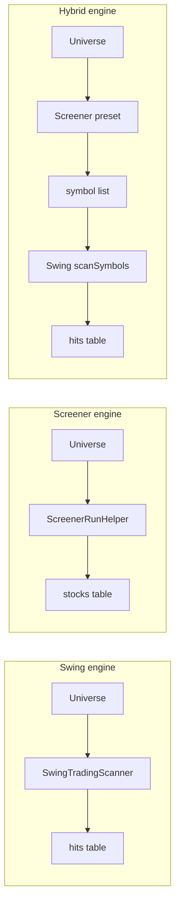

# Trading Strategies — Architecture & Speed Plan

**Trading Strategies** is the curated strategy runner: 21 registered filters across swing TA, CFA screener presets, and hybrid pipelines — with style tabs, universe selection, background jobs, and unified results tables.

In **Script Screener v2 this does not exist.** Screener and swing scan are separate pages with manual forms. There is no `StrategyRegistry`, no hybrid screener→swing pipeline, and no strategy job API.

> Educational only — strategies route to existing engines; verify on NSE before orders.

**Related:** [Trading Presets](TRADING-PRESETS.md) (3 daily quick-launch profiles) · [CFA Screener](SCREENER.md) · [Swing Auto](SWING-AUTO.md)

---

## Table of contents

1. [What it does](#what-it-does)
2. [PHP vs Script Screener](#php-vs-script-screener)
3. [Strategy styles & engines](#strategy-styles--engines)
4. [Strategy catalog](#strategy-catalog)
5. [StrategyRunner pipeline](#strategyrunner-pipeline)
6. [Background jobs](#background-jobs)
7. [UI surfaces](#ui-surfaces)
8. [Why the new architecture can be faster](#why-the-new-architecture-can-be-faster)
9. [System architecture (planned)](#system-architecture-planned)
10. [API mapping (PHP → v2)](#api-mapping-php--v2)
11. [Parity matrix](#parity-matrix)
12. [Speed optimization plan](#speed-optimization-plan)
13. [Implementation phases](#implementation-phases)
14. [File reference](#file-reference)

---

## What it does

| Capability | Description |
|------------|-------------|
| **21 curated strategies** | Swing (6) · Positional (13) · Hybrid (2) |
| **3 execution engines** | Swing scanner · CFA screener · Hybrid (screener then swing) |
| **Style tabs** | All · Swing trading · Positional · Hybrid |
| **Universe picker** | nifty50 … nifty500, swing_tier_a, custom |
| **Max scan** | 0 = strategy default / full universe cap |
| **Background jobs** | Auto-dispatch when scan size exceeds threshold |
| **Job progress** | Phase/stage bar (prefetch → analyze → done) |
| **Swing results** | Rank, tier, discovery/strict verdict, stop/target, R, add position |
| **Screener results** | Score, MOS, moat, optional TA columns |
| **Hybrid results** | Stage 1 screener count + Stage 2 swing hits |
| **Cross-links** | Verify, swing symbol, watchlist, full screener |

---

## PHP vs Script Screener

| Aspect | PHP (`stock-verifier`) | Script Screener (`stock-verifier-v2`) |
|--------|------------------------|--------------------------------------|
| **Page** | `strategies.php` (nav: Strategies) | **No route** |
| **Planned route** | — | `/strategies` |
| **Registry** | `StrategyRegistry` — 21 strategies | **Not ported** |
| **Runner** | `StrategyRunner` — 3 engines | Screener + swing scan **separate** |
| **Hybrid pipeline** | Screener → symbol list → swing scan | **Not implemented** |
| **API** | `strategy-job.php` + cache jobs | BullMQ `sv-screener` / `sv-swing-scan` only |
| **Style tabs** | 4 tabs (all/swing/positional/hybrid) | **None** |
| **Screener presets in strategies** | 13 positional + 2 hybrid (30+ preset keys) | **7** presets in `PRESET_FILTERS` |
| **Swing strategies** | 6 with zone/breakout filters | Manual `/swing` form only |
| **TA-heavy screener presets** | `cfa_best_opportunity`, `ta_pullback`, etc. | **No TA enrichment** in screener |
| **Background threshold** | Per-engine (swing 25, screener 400/80 TA) | Screener ≥400; swing ≥25 |
| **User custom strategies** | Not on this page (future) | `screener_presets` table — no CRUD |
| **vs Trading Presets** | Full strategy catalog | [TRADING-PRESETS.md](TRADING-PRESETS.md) — 3 URL shortcuts only |

---

## Strategy styles & engines

### Styles (`StrategyRegistry::styleLabels`)

| Style key | Label | Count |
|-----------|-------|-------|
| `all` | All strategies | 21 |
| `swing` | Swing trading | 6 |
| `positional` | Positional investing | 13 |
| `hybrid` | Hybrid (CFA + swing) | 2 |

### Engines

| Engine | Routes to | Output |
|--------|-----------|--------|
| `swing` | `SwingTradingScanner::scanUniverse()` | `hits[]` with verdict, rank, stops |
| `screener` | `ScreenerRunHelper::runFromInput()` | `stocks[]` with MOS, score, moat |
| `hybrid` | Screener first → `scanSymbols()` on passers | Swing `hits[]` + screener summary |



---

## Strategy catalog

### Swing (6) — engine `swing`

| Key | Label | min_verdict | sort_by | Special filters |
|-----|-------|-------------|---------|-----------------|
| `swing_setup_plus` | SETUP+ Discovery | SETUP_PLUS | rules_passed | Default Tier-A universe |
| `swing_strict_enter` | Strict ENTER | ENTER | r_multiple | Full E1–E8 |
| `swing_watch_early` | Early WATCH | WATCH | pct_52w | nifty250, max 300 |
| `swing_green_zone` | Green Zone (52w Low) | SETUP_PLUS | pct_52w | `zone_52w=green` |
| `swing_breakout_volume` | Breakout + Volume | SETUP_PLUS | volume_ratio | `breakout_volume=true` |
| `swing_best_r` | Best R-Multiple | SETUP_PLUS | swing_rank | CFA swing rank |

Default universe: `swing_tier_a` (12 names) for most; `nifty250` for watch_early.

### Positional (13) — engine `screener`

| Key | Label | screener preset | sort_by | Horizon |
|-----|-------|-----------------|---------|---------|
| `pos_quality` | Quality Compounders | `quality` | score | 3–12+ months |
| `pos_moat_compounders` | Wide Moat Compounders | `moat_compounders` | moat | 1–3 years |
| `pos_monopoly_stocks` | Monopoly & Oligopoly | `monopoly_stocks` | monopoly | 3–10+ years |
| `pos_green_zone` | 52w Green Zone | `ta_green_zone` | ta_pct_52w | 3–12 months |
| `pos_red_zone` | 52w Red Zone | `ta_red_zone` | ta_pct_52w | 3–9 months |
| `pos_buy_zone` | Buy Zone (MOS ≥ 15%) | `buy_zone` | mos | 6–18 months |
| `pos_deep_value` | Deep Value | `deep_value` | mos | 6–24 months |
| `pos_growth` | GARP Growth | `growth` | score | 6–18 months |
| `pos_defensive` | Defensive Dividend | `defensive` | div_yield | 1–3 years |
| `pos_moat_bottom` | Moat @ Bottom (TA) | `cfa_moat_bottom` | mos | 3–12 months |
| `pos_moat_uptrend` | Moat Uptrend | `cfa_moat_uptrend` | score | 3–12 months |
| `pos_best_opportunity` | Best Opportunity | `cfa_best_opportunity` | recommendation | 3–12 months |
| `pos_pullback_timing` | Pullback Entry (TA) | `ta_pullback` | ta_rsi | 1–6 months |

Default universe: `nifty500` (most); `nifty250` for pullback.

**v2 gap:** Only `quality`, `strong_buy`, `buy_picks`, `fair_mos`, `value`, `growth`, `cfa_top` exist in `PRESET_FILTERS` — **10+ positional presets missing**, especially TA/combined presets.

### Hybrid (2) — engine `hybrid`

| Key | Label | Screener stage | Swing stage |
|-----|-------|----------------|-------------|
| `hybrid_quality_swing` | Quality → Swing SETUP+ | `quality` (max 200) | SETUP+ · swing_rank |
| `hybrid_moat_swing` | Moat @ Value → Swing | `moat_at_value` (max 150) | SETUP+ · swing_rank |

Pipeline: run screener → extract symbols → filter to universe → `SwingTradingScanner::scanSymbols()`.

---

## StrategyRunner pipeline

### Input

```php
StrategyRunner::run($strategyKey, [
  'universe' => 'nifty500',
  'max_scan' => 0,  // 0 = strategy default
], $onProgress);
```

### Swing engine params (from registry def)

```php
SwingTradingScanner::scanUniverse($universe, [
  'max_scan'        => $maxScan,
  'min_verdict'     => $def['min_verdict'],
  'sort_by'         => $def['sort_by'],
  'zone_52w'        => $def['zone_52w'] ?? 'any',
  'breakout_volume' => $def['breakout_volume'] ?? false,
  'rank_hits'       => true,
  'on_progress'     => $progress,
]);
```

### Background decision

| Engine | Background when |
|--------|-----------------|
| Swing | `SwingScanJob::shouldRunInBackground(symbolCount)` — typically ≥25 |
| Screener | `ScreenerJob::shouldRunInBackground(count, taHeavy)` — 400 or 80 if TA preset |
| Hybrid | Either stage exceeds its threshold |

Tier-A swing strategies (`swing_tier_a`, 12 symbols) usually run **inline**.

### Output shape

```json
{
  "ok": true,
  "strategy": "hybrid_quality_swing",
  "engine": "hybrid",
  "style": "hybrid",
  "label": "Hybrid — Quality → Swing SETUP+",
  "horizon": "2–12 weeks",
  "universe": "nifty500",
  "screener_passed": 42,
  "screener_preset": "quality",
  "elapsed_sec": 18.4,
  "result": { "hits": [], "hit_count": 5, "scanned": 42 },
  "screener": { "stocks": [], "scanned": 500, "passed": 42 }
}
```

---

## Background jobs

### PHP

| Component | Role |
|-----------|------|
| `StrategyJob` | CRUD in `strategy_job` cache source |
| `run-strategy-job.php` | CLI worker spawn |
| `strategy-job.php` | JSON status API (poll) |

Flow: POST run → `create()` → `spawn()` → redirect `?job_id=` → poll progress → render result.

Progress fields: `phase` (pending/loading/analyze/done), `stage` (screener/swing), `total`, `processed`, `passed`.

### v2 planned

Use existing BullMQ infrastructure with new job type:

```
JobType.strategy_run
Queue: sv-strategy
```

Or compose: enqueue screener job → on complete enqueue swing job with symbol list (hybrid).

WebSocket progress via existing `/ws/jobs/:id` (Phase 9 chunked progress).

---

## UI surfaces

### PHP `strategies.php`

1. Morning routine promo card
2. Background job banner + progress bar (if `job_id` in flight)
3. Style tabs (all / swing / positional / hybrid)
4. Form: strategy select, universe, max_scan, async checkbox, Run
5. Results card:
   - **Screener:** symbol, verdict, score, MOS, ROCE, P/E, moat, RSI/52w/bottom-out (if combined preset)
   - **Swing/Hybrid:** rank, tier, discovery/strict, rules, price, stop, target, R, RSI, 52w%, add position
6. Empty-state hints linking to screener or wider universe
7. JS: strategy description + background threshold hints on select change

### v2 today

| Need | Page |
|------|------|
| Positional scan | `/screener` — 7 presets, manual |
| Swing scan | `/swing` — manual filters |
| Hybrid | **Not possible** without two manual steps |

### v2 planned (`/strategies`)

```
┌─────────────────────────────────────────────────┐
│ Style tabs: All | Swing | Positional | Hybrid    │
├─────────────────────────────────────────────────┤
│ Strategy ▼  Universe ▼  Max scan  [ ] Background │
│ [Run strategy]                                   │
├─────────────────────────────────────────────────┤
│ Results (engine-specific table)                  │
│ Job progress bar (WebSocket)                       │
└─────────────────────────────────────────────────┘
```

---

## Why the new architecture can be faster

### 1. Hybrid as single BullMQ workflow

PHP hybrid runs synchronously in one HTTP request (screener + swing sequential in-process).

v2: screener job completes → worker passes symbol list to swing scan without re-fetching universe metadata.

### 2. Shared Redis caches

Strategy run on `nifty500` + `quality` preset hits `sv:stock:*` for symbols already scanned today — second strategy reuses fetch cache.

### 3. Parallel symbol fetch in worker

PHP screener sequential; v2 Phase S-D (screener doc) targets parallel fetch — strategies inherit speedup automatically.

### 4. PostgreSQL job history

PHP `strategy_job` in file cache — lost on deploy. v2 `jobs` table already exists — persist strategy runs for audit and re-display.

### Latency budget (planned)

| Strategy type | Inline (warm) | Background |
|---------------|---------------|------------|
| Swing Tier-A (12) | p95 < **30s** | — |
| Screener nifty50 | p95 < **60s** | — |
| Screener nifty500 | — | job < **8 min** |
| Hybrid quality→swing | — | job < **10 min** |

---

## System architecture (planned)

```
┌──────────────┐  POST /api/v1/strategies/run     ┌─────────────┐
│ Strategies   │ ◄──────────────────────────────►│   Fastify   │
│    Page      │  GET  /api/v1/strategies/jobs/:id └──────┬──────┘
└──────────────┘  GET  /api/v1/strategies                  │
                                                          ▼
                                               ┌──────────────────┐
                                               │ strategy-runner  │
                                               │ (StrategyRunner) │
                                               └────────┬─────────┘
                                                        │
              ┌─────────────────────┬───────────────────┼──────────────────┐
              ▼                     ▼                   ▼                  ▼
      strategy-registry      runLiveScreener      swing scanner      jobs table
      (21 definitions)       PRESET_FILTERS+      scanUniverse       + WebSocket
                             expanded presets     scanSymbols
```

### v2 building blocks today

| Block | Status |
|-------|--------|
| `runLiveScreener()` | ✅ |
| `POST /api/v1/swing/scan` | ✅ |
| `POST /api/v1/screener/run` | ✅ |
| BullMQ + job progress WS | ✅ (final only) |
| `PRESET_FILTERS` (7 keys) | Partial |
| Hybrid orchestrator | ❌ |
| `StrategyRegistry` | ❌ |
| TA screener presets | ❌ |
| `zone_52w`, `breakout_volume` on scan API | ✅ (swing schema) |

---

## API mapping (PHP → v2)

| PHP | Planned v2 |
|-----|------------|
| GET `strategies.php?style=swing` | `GET /api/v1/strategies?style=swing` + `/strategies?style=swing` |
| POST run strategy | `POST /api/v1/strategies/run` |
| `strategy-job.php?action=status` | `GET /api/v1/strategies/jobs/:id` + WS |
| `StrategyRegistry::all()` | Static module + optional DB seed for system strategies |
| User custom strategy | `POST /api/v1/strategies` (M11 CRUD) |

### Run request

```json
{
  "strategy": "hybrid_quality_swing",
  "universe": "nifty500",
  "max_scan": 0,
  "background": true
}
```

### List response (excerpt)

```json
{
  "strategies": [
    {
      "key": "swing_strict_enter",
      "label": "Swing — Strict ENTER",
      "style": "swing",
      "engine": "swing",
      "horizon": "2–6 weeks",
      "description": "Full E1–E8 + price action...",
      "universe_default": "swing_tier_a",
      "max_scan_default": 0,
      "ready": false,
      "blocked_reason": "Universe swing_tier_a not configured"
    }
  ],
  "styles": [
    { "key": "all", "label": "All strategies" },
    { "key": "swing", "label": "Swing trading" }
  ]
}
```

---

## Parity matrix

| Feature | PHP | v2 | Gap |
|---------|-----|-----|-----|
| `/strategies` page | ✓ | ✗ | **TS-A** |
| 21 system strategies | ✓ | ✗ | **TS-A** |
| Style tabs | ✓ | ✗ | **TS-A** |
| StrategyRunner 3 engines | ✓ | ✗ | **TS-B** |
| Hybrid screener→swing | ✓ | ✗ | **TS-C** |
| Swing zone/breakout strategies | ✓ | partial API | **TS-B** |
| 13 positional presets | ✓ | 7 basic | **TS-D** |
| TA/combined screener presets | ✓ | ✗ | **TS-D** |
| Background strategy jobs | ✓ | partial (separate queues) | **TS-E** |
| Job progress UI | ✓ | WS done-only | **TS-E** |
| Swing results + add position | ✓ | partial | **TS-F** |
| Screener TA columns in results | ✓ | ✗ | **TS-D** |
| `validate-logic` registry tests | ✓ | ✗ | **TS-F** |
| User custom strategies | — | table only | **M11** |

---

## Speed optimization plan

### Phase TS-A — Registry & hub (2–3 days)

| # | Task |
|---|------|
| TS-A1 | Port `StrategyRegistry` → `packages/swing/src/strategy-registry.ts` (21 entries) |
| TS-A2 | `GET /api/v1/strategies` — list + filter by style |
| TS-A3 | `StrategiesPage.tsx` — tabs + strategy select + description |
| TS-A4 | Nav item "Strategies" under Trading group |

### Phase TS-B — Swing & screener engines (3–4 days)

| # | Task |
|---|------|
| TS-B1 | `runStrategy()` — dispatch swing engine via existing swing scan service |
| TS-B2 | Dispatch screener engine via `runLiveScreener` + expanded preset map |
| TS-B3 | `POST /api/v1/strategies/run` — sync path for small scans |
| TS-B4 | Results tables: swing hits + screener stocks (basic columns) |
| TS-B5 | `swing_tier_a` universe seed (shared with [TRADING-PRESETS.md](TRADING-PRESETS.md) TP-C) |

### Phase TS-C — Hybrid pipeline (3–4 days)

| # | Task |
|---|------|
| TS-C1 | `wrapHybrid()` — screener → symbol extract → `scanSymbols` |
| TS-C2 | Progress callbacks: stage `screener` then `swing` |
| TS-C3 | Hybrid results header (stage 1 passed count) |
| TS-C4 | BullMQ composite job or chained jobs |

### Phase TS-D — Screener preset expansion (4–5 days)

| # | Task |
|---|------|
| TS-D1 | Port missing `NseStockScreener::PRESETS` keys to `@sv/core` or DB seed |
| TS-D2 | TA enrichment path for `cfa_*` and `ta_*` presets (SCREENER S-B) |
| TS-D3 | Combined preset result columns (RSI, 52w, bottom-out) |
| TS-D4 | Enable positional strategies `ready: true` as presets land |

### Phase TS-E — Background jobs & progress (2–3 days)

| # | Task |
|---|------|
| TS-E1 | `JobType.strategy_run` + worker handler |
| TS-E2 | Auto-background via `StrategyRunner::shouldRunInBackground()` logic |
| TS-E3 | Chunked WS progress (Phase 9) — per-symbol processed count |
| TS-E4 | `GET /api/v1/strategies/jobs/:id` |

### Phase TS-F — UX & parity (2 days)

| # | Task |
|---|------|
| TS-F1 | Port `testStrategyRegistry()` to vitest |
| TS-F2 | Row actions: Verify, Swing symbol, Watchlist, Add position |
| TS-F3 | Deep link `?strategy=swing_strict_enter&universe=nifty500` |
| TS-F4 | User custom strategies CRUD (M11 overlap) |

### Acceptance criteria

- [ ] All 21 system strategies listed with correct engine/style
- [ ] `swing_strict_enter` on Tier-A returns hits inline < **30s** (warm)
- [ ] `hybrid_quality_swing` on nifty500 runs as background job with progress
- [ ] `pos_quality` uses screener preset matching PHP filters
- [ ] Style tab filters work; unknown strategy returns 400
- [ ] vitest registry + runner rejection tests pass

---

## Implementation phases

```
Now — /screener and /swing only; no unified runner
  │
  ├─► TS-A: Registry + /strategies hub
  │
  ├─► TS-B: Swing + screener engine wiring
  │
  ├─► TS-C: Hybrid pipeline
  │
  ├─► TS-D: Expand screener presets + TA (blocks many positional strategies)
  │
  ├─► TS-E: Background jobs + progress
  │
  └─► TS-F: Parity tests + row actions + M11 user CRUD
```

**Milestone:** Maps to **M11** in [MILESTONES.md](MILESTONES.md). TS-A–C can ship as read-only system strategies before user CRUD.

**vs Trading Presets:** [TRADING-PRESETS.md](TRADING-PRESETS.md) covers 3 daily URL shortcuts; this doc covers the full 21-strategy research catalog.

---

## File reference

### Script Screener (v2) — existing

```
packages/core/src/screener.ts           PRESET_FILTERS (7 keys)
packages/data-adapters/src/screener-run.ts  runLiveScreener
packages/swing/src/scanner.ts           scanUniverse, filters
apps/api/src/services/screener.ts
apps/api/src/services/swing.ts
apps/web/src/pages/ScreenerPage.tsx
apps/web/src/pages/SwingScanPage.tsx
packages/db/prisma/schema.prisma        ScreenerPreset model (unused)
packages/jobs/src/index.ts              BullMQ queues
```

### Script Screener (v2) — planned

```
packages/swing/src/strategy-registry.ts
packages/swing/src/strategy-runner.ts
apps/api/src/services/strategies.ts
apps/web/src/pages/StrategiesPage.tsx
apps/worker/src/strategy-handler.ts
```

### PHP reference (stock-verifier)

```
strategies.php
includes/StrategyRegistry.php         21 strategies
includes/StrategyRunner.php           3 engines
includes/StrategyJob.php
run-strategy-job.php
strategy-job.php
validate-logic.php                    testStrategyRegistry()
includes/NseStockScreener.php         30+ PRESETS
docs/CFA-SWING-TRADING-STRATEGY-AUDIT.md
```

---

## Related docs

- [Trading Presets](TRADING-PRESETS.md) — 3 one-click daily profiles (different feature)
- [CFA Screener](SCREENER.md) — positional engine + preset expansion (S-B, S-D)
- [Swing Auto](SWING-AUTO.md) — swing engine, strict ENTER
- [Swing Positions](SWING-POSITIONS.md) — add position from results
- [Morning Routine](MORNING-ROUTINE.md) — daily cockpit (not strategy runner)
- [Roadmap Phase 11](ROADMAP.md) — strategy builder milestone
- [Development Milestones](MILESTONES.md) — M11 acceptance criteria
